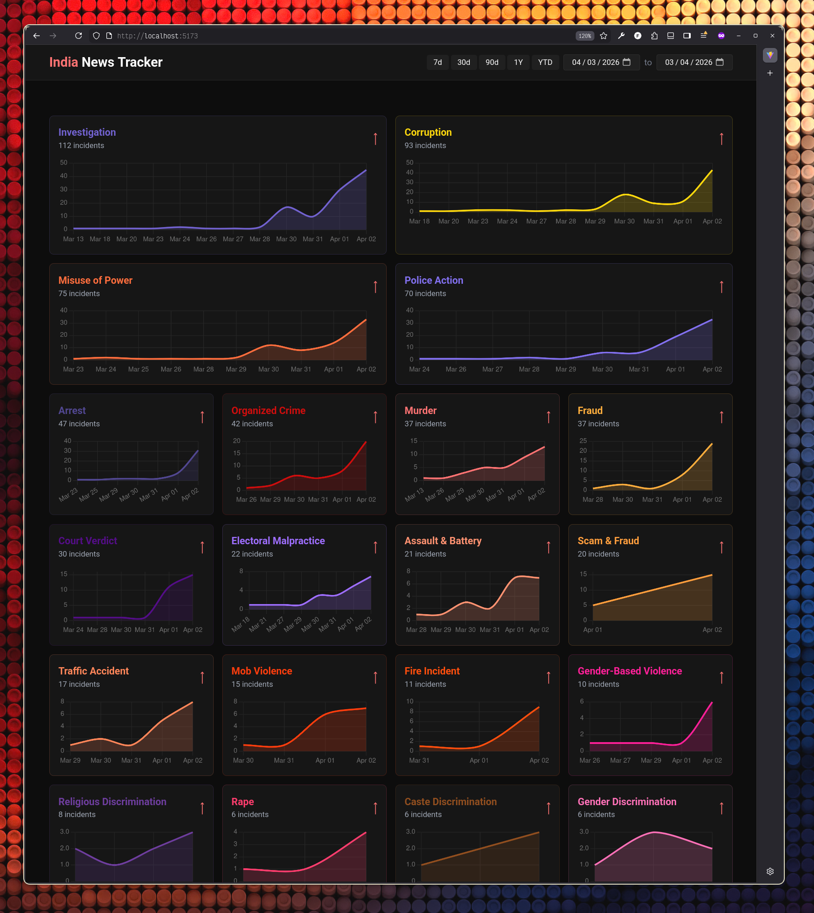

# India News Tracker



Automated pipeline that fetches Indian news via RSS, scrapes full article content, and classifies articles using an LLM. Results are served through a FastAPI backend and displayed on a React dashboard.

## Quick Start

```bash
# 1. Clone & configure
cp .env.example .env   # then fill in values (see below)

# 2. Run everything
docker compose up --build
```

That's it. On first boot the database schema is applied automatically.

| Service   | URL                        |
| --------- | -------------------------- |
| Dashboard | http://localhost:5173      |
| API       | http://localhost:8000      |
| API Docs  | http://localhost:8000/docs |
| Postgres  | localhost:5433             |

## What Happens on `docker compose up`

1. **db** — TimescaleDB starts; `database/schema.sql` is applied on first run via `docker-entrypoint-initdb.d`.
2. **api** — FastAPI server on port 8000 (waits for healthy db).
3. **worker** — Runs an infinite loop: **fetch RSS → scrape articles → classify with LLM**. Intervals and batch sizes are configurable (see below).
4. **frontend** — Vite dev server on port 5173, proxies `/api` to the API container.

## Environment Variables

Create a `.env` file in the project root. Required variables:

```
# Postgres
POSTGRES_USER=newstrack
POSTGRES_PASSWORD=<secret>
POSTGRES_DB=newstrack
POSTGRES_HOST=localhost        # docker-compose overrides to "db"
POSTGRES_PORT=5433             # host port; containers use 5432 internally

# LLM — at least one is required for classification
GOOGLE_API_KEY=<key>           # Gemini (default provider)
OPENAI_API_KEY=<key>           # OpenAI (optional)
ANTHROPIC_API_KEY=<key>        # Anthropic (optional)
COHERE_API_KEY=<key>           # Cohere (optional)

# App
ENVIRONMENT=development
LOG_LEVEL=INFO
PORT=8000
```

### Worker Tuning (optional)

Set these in `.env` or directly in `docker-compose.yml`:

| Variable              | Default | Description                      |
| --------------------- | ------- | -------------------------------- |
| `FETCH_INTERVAL`      | 300     | Seconds between RSS fetch cycles |
| `SCRAPE_INTERVAL`     | 120     | Seconds between scrape cycles    |
| `CLASSIFY_INTERVAL`   | 120     | Seconds between classify cycles  |
| `SCRAPE_BATCH_SIZE`   | 50      | Articles per scrape batch        |
| `CLASSIFY_BATCH_SIZE` | 20      | Articles per classify batch      |

## Running Pipeline Steps Manually

If you want to run a single step instead of the continuous worker:

```bash
docker compose exec api python -m scripts.fetch_rss
docker compose exec api python -m scripts.scrape_content
docker compose exec api python -m scripts.classify_articles
```

## Config Files

All in `config/`, mounted into containers at `/app/config`.

| File               | Purpose                         |
| ------------------ | ------------------------------- |
| `rss-sources.yaml` | RSS feed URLs and metadata      |
| `tags.yaml`        | Classification tags/categories  |
| `filters.yaml`     | Article filtering rules         |
| `llm-config.yaml`  | LLM provider and model settings |
| `prompts/`         | Prompt templates for LLM tasks  |

## API Endpoints

| Method | Path                         | Description            |
| ------ | ---------------------------- | ---------------------- |
| GET    | `/api/v1/events`             | List news events       |
| GET    | `/api/v1/events/{id}`        | Single event detail    |
| GET    | `/api/v1/events/timeline`    | Events grouped by date |
| GET    | `/api/v1/search`             | Full-text search       |
| GET    | `/api/v1/analytics/overview` | Dashboard stats        |
| GET    | `/api/v1/analytics/trends`   | Category/tag trends    |
| GET    | `/api/v1/config/categories`  | Available categories   |
| GET    | `/health`                    | Health check           |

## Development (without Docker)

```bash
# Backend
cd backend
python -m venv .venv && source .venv/bin/activate
pip install -r requirements.txt
uvicorn app.main:app --reload

# Frontend
cd frontend
npm install
npm run dev
```

Requires a running Postgres/TimescaleDB instance — apply `database/schema.sql` manually.
